# Same Again: functional, catalogue and receipt review (25 September 2026)

This review follows [REVIEW-2026-09.md](REVIEW-2026-09.md), whose findings were fixed in `faa95fb`. It covers four questions:

1. Does every feature still work, and what new bugs are there?
2. How does the catalogue compare with Coop and Migros?
3. How well does the receipt reader handle Swiss receipts, and can receipts feed the catalogue?
4. What is needed to compete with Yuka?

Every finding below was fixed on this branch unless it is listed under [Open items](#6-open-items).

## 1. Checks run

| Check | Before | After |
| --- | --- | --- |
| `npm run typecheck` | pass | pass |
| `npm run lint` | pass, no warnings | pass, no warnings |
| `npm run format:check` | pass | pass |
| `npm test` | 197 pass | 215 pass (12 domain, 194 route/feature, 9 service worker) |
| `python3 tests/retailer-import.test.py` | 2 pass | 2 pass |
| `npm run build` | pass | pass; catalogue assets 28 MB in `dist/client/catalogue` |
| `npm run test:e2e` (Playwright, desktop + mobile) | 20 pass | 28 pass, including new health-score, receipt-linking, Swiss-shop and guide scenarios with axe scans |

New tests cover the health score, the catalogue shards and endpoints, five Swiss receipt layouts, receipt-product linking, former-member items, invitation reloads, server deletions during a resync, and quick-add parsing. The new E2E scenario also found a pre-existing contrast failure (4.43:1) in the “Photo unavailable” fallback, now fixed. The two sync tests were checked to fail against the previous engine.

## 2. Functional review: new bugs found

A read-and-run review of every feature path found 11 new issues. Four were reproduced by running the real route or sync engine, two by running the pure functions, and five by reading the code.

| # | Severity | Issue | Fix |
| --- | --- | --- | --- |
| 1 | High | An item assigned to, or intended for, a member who then left could not be ticked, edited or deleted. Each attempt failed with 400/403, which blocked the whole outbox. "Same again" from history or favourites failed the same way. | Unchanged member fields are accepted. New items drop a former member's name. Alternatives fall back to the requester's preferences. |
| 2 | Medium | Editing an item on an abroad copy wiped a newly typed price, because its `priceCurrency` still named the original currency. | Only prices already stored in the old currency are cleared. Abroad copies set `priceCurrency` to the destination currency. |
| 3 | Low–medium | Abroad copies and new lists used EUR for Denmark, Sweden, Norway, Poland, Czechia, Hungary, Romania and Iceland. | A shared `countryCurrency()` map. |
| 4 | Medium–low | Pending invitations disappeared after a reload, because a 304 answered the first poll and invitations are not cached. | The first poll of a session skips `If-None-Match`. |
| 5 | Medium–low | Quantity fields snapped back to 1 while typing, so 0.5 became 1.5. | Empty or partial entries are kept while typing; the form requires a value. |
| 6 | Low | Rows deleted on the server could reappear on a device and stay, when a full resync coincided with an acknowledged operation. | That snapshot no longer advances the cursor, so the next poll is full again. |
| 7 | Low | Every successful search showed its informational notice as an error (`role="alert"`). | Notices and errors are kept separate. |
| 8 | Low | The "Create destination list" button could stay disabled after an approved item was ticked off. | Only decisions for items still outstanding are counted. |
| 9 | Low | Quick-add misread "2 x 1.5 l water", "1.000 g Mehl", "Omega 3", "Vitamin B 12" and "7 up". It also filed butternut squash under Dairy, pearl barley under Fruit & vegetables, Eiscreme under Dairy and Rollmops under Bakery. | Multipack, thousands-separator and named-number rules; specific keywords are checked first. |
| 10 | Low | Observation dates used UTC, so in Switzerland between midnight and 02:00 the default was yesterday. | `localDate()` is used. |
| 11 | Low | An invitation link without a code showed a raw validation error. | "This link has no invitation code" is shown before any request. |

## 3. Catalogue compared with Coop and Migros

### Data gathered

The public Open Food Facts nightly export of 25 September 2026 (1.27 GB compressed, 4.54 million products) was streamed once. All named products tagged for Switzerland were kept: 98,179 products. A product counts for a retailer when a community store tag or a retailer own brand links it to that chain. Examples of own brands are Naturaplan, Prix Garantie, Karma and Betty Bossi for Coop, and M-Classic, M-Budget, Aproz and Anna's Best for Migros.

| | Previous snapshot | New snapshot |
| --- | ---: | ---: |
| Coop products | 3,534 | 12,986 (3.7×) |
| Migros products | 9,759 | 16,831 (1.7×) |
| Denner, Lidl, Aldi, Volg, Spar, Manor, Globus | not indexed | 4,229 |
| Searchable retailer products | 13,249 | 33,759 |
| Products found by barcode | 13,249 | 98,179 |
| Products with nutrition | 6 | 85,611 |
| Products with ingredients | 6 | 33,024 |
| Products with a Nutri-Score | 0 | 41,132 |
| Search index size | 9.8 MB | 7.5 MB (compact format) |

### How it is served

A single index at this scale would not fit a Worker isolate, so the data is split in two:

- a compact search index for the retailer-linked products;
- 100 gzipped barcode shards holding full records for every Swiss product.

A barcode scan now reads one shard of about 280 KB instead of calling Open Food Facts. The shared quota (15 reads per minute across all users) was the main obstacle to Yuka-like scanning volume, so scans are served from the export for up to 30 days before a live refresh.

### Coverage gap

The absolute gap to the real assortments could not be measured:

- coop.ch and migros.ch were not reachable from the review environment;
- both retailers' product APIs require client keys;
- no complete public assortment list exists.

Open Food Facts depends on its community, so coverage is strongest for branded and own-brand packaged food. Fresh counter goods, variable-weight articles and non-food items are thin. A contracted retailer feed is still the only way to claim full coverage.

## 4. Receipt reader

Synthetic receipts modelled on current Coop, Migros, Denner and Lidl layouts showed five defects in the parser:

| Defect | Effect | Fix |
| --- | --- | --- |
| Lines with one price and no quantity column were marked "quantity unclear" and deselected. | Nearly every Migros, Lidl, Aldi and Denner row needed a manual tick. | On those layouts, one price per line means one article. |
| A Migros weight line below its article (`0.785 kg x 2.99 CHF/kg`) was dropped. | Weighed produce kept quantity 1. | The weight and unit price are attached to the article above when they match its total. |
| `6x1.5l` was read as pack `5l`. | Multipack sizes were wrong. | Multipack pattern. |
| Aktion, Cumulus-Rabatt and Mengenrabatt lines were discarded. | Every receipt with a promotion showed "totals do not match". | The discount is deducted from the article above. A discount that fits no item is reported and never applied silently. |
| Denner, Lidl, Aldi, Volg, Spar and Manor were not recognised as stores. | The store field stayed empty. | Store detection now uses the receipt header. |

CHF totals now allow for 5-Rappen rounding.

After the fixes, all five sample receipts parse with the correct quantities and totals and **no warnings**.

**Receipts can now feed products.** After parsing, each line is matched against the saved Swiss index for the receipt's retailer. When every word of a line matches a product, the review row offers "Link this product"; nothing is linked automatically. A linked row adds a real catalogue product, with its health score, to the list instead of a generic grocery.

Not verified here: OCR accuracy on real photographs. The parser was tested on clean text. Real thermal-paper photos add OCR noise, which the existing tests cover only in part.

## 5. Competing with Yuka

Before this review the app had no product rating at all. Yuka's core experience is:

1. scan a product;
2. see a 0–100 score from nutrition (60%), additives (30%) and organic (10%);
3. see why;
4. get better alternatives.

This branch adds all four, with the method visible to the user:

- **Nutri-Score.** The Open Food Facts grade is used when recorded. Otherwise the 2023 algorithm is computed from declared values and labelled as an estimate. Against 40,857 Swiss products with an Open Food Facts grade, the estimate gives the same grade for 90.9% and is within one grade for 97.3%. By type: fats 98.1%, cheese 97.8%, red meat 99.3%, beverages 89.2%, other foods 90.1%.
- **Additives.** 49 additive codes carry flags based on EU, EFSA and WHO/IARC evidence, each with a source link. Unflagged additives are shown as unflagged, never as safe.
- **Organic.** EU organic, Bio Suisse, Demeter and retailer bio labels count.
- **NOVA.** Shown but not scored. Unknown nutrition means **not scored** rather than a guess.
- **Better alternatives.** Products from the same specific category that score at least 10 points higher, filterable to Coop or Migros. For example, Pringles Sour Cream & Onion (45) → Zweifel Paprika chips (63) → Alnatura kettle chips (73), all at Migros.

Where Same Again can now go beyond Yuka:

- alternatives restricted to the shop you use;
- household allergy and preference constraints already applied elsewhere in the app;
- shared family lists;
- receipts that turn into scored products.

Where Yuka is still ahead:

- **Cosmetics.** Open Beauty Facts is available in the same export bucket and could be added.
- **Its own product-submission flow and editorial additive database.**
- **A polished scan-first home screen.**

## 6. Follow-up completed on 26 September

- **Denner, Lidl and Aldi are shops.** They are in `lib/retailers.ts`, the store hub, saved branches (shop validation now accepts any configured retailer), offers, map matching, receipt-product suggestions and the health panel's alternatives filter. Their offers links open the retailer home page, because no offers page could be verified from this environment.
- **The in-app guide is rewritten** as user help (`app/guide/guide.json`, rendered with headings and lists): lists, search and scan, the catalogue counts, the health score, alternatives, receipts, meals, shops and privacy.
- **Receipt-product linking has a Playwright scenario.** A pasted Migros receipt offers "Link this product" for a matching line and nothing for an abbreviation. The linked row is added with the product's brand and pack, and the abbreviation stays a generic grocery.
- New Playwright scenarios also cover choosing and searching Denner, Lidl and Aldi, and the guide. Each scenario runs an axe scan on desktop and mobile.

### Screenshots

These were captured by the Playwright scenarios on 26 September, on desktop Chrome and a Pixel 7 viewport. Remote product photos were blocked in the tests, so products show the photo fallback.

| Flow | Desktop | Mobile |
| --- | --- | --- |
| Health score, breakdown and Migros alternatives | 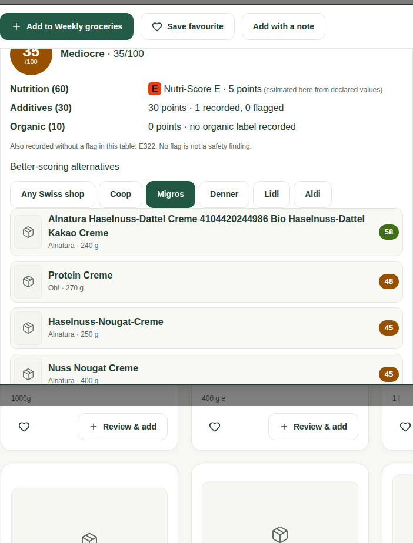 | 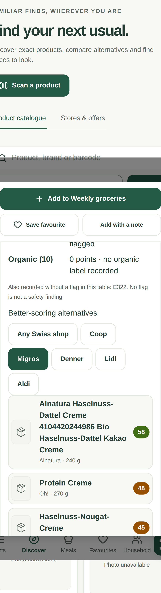 |
| Receipt row with a suggested product | 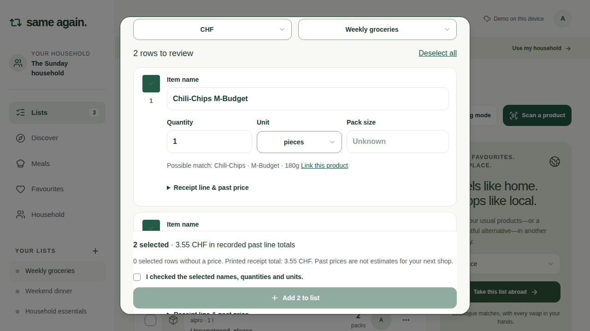 |  |
| Receipt row after linking |  | 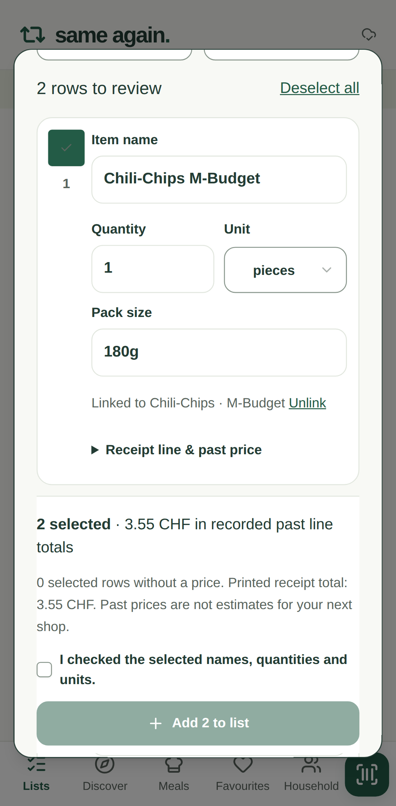 |
| List: linked row (brand and pack) and generic row | 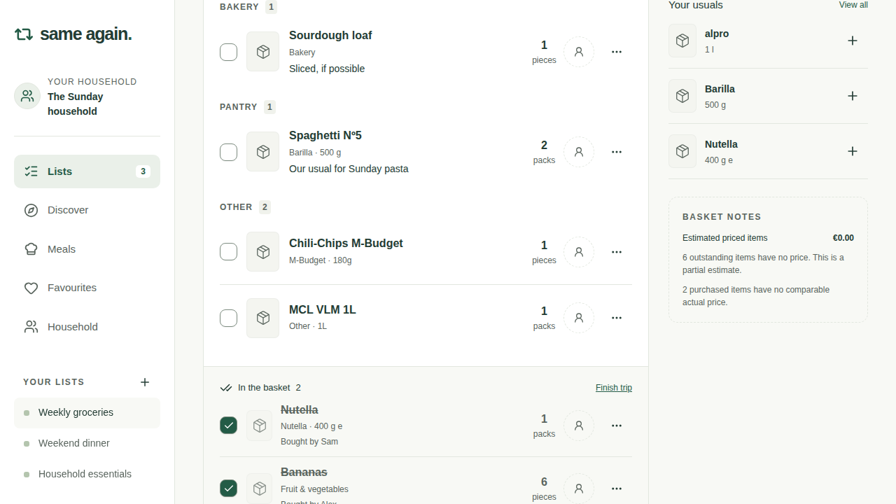 | 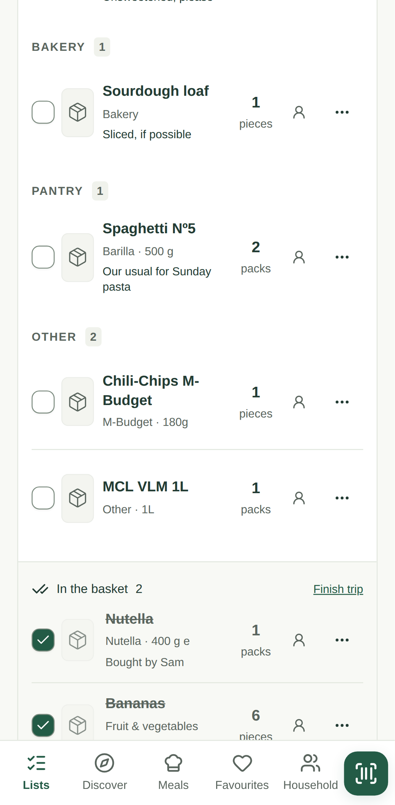 |
| Denner search | 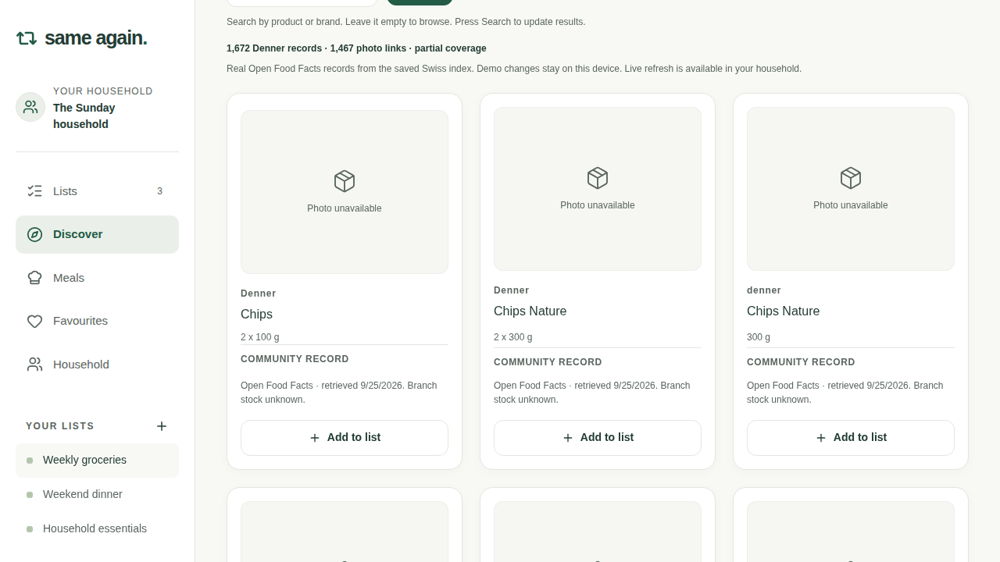 | 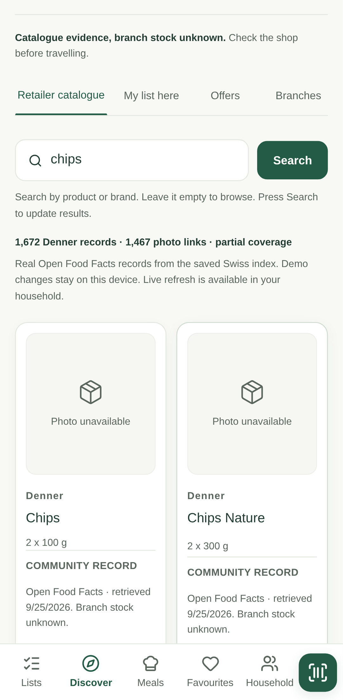 |
| Lidl search | 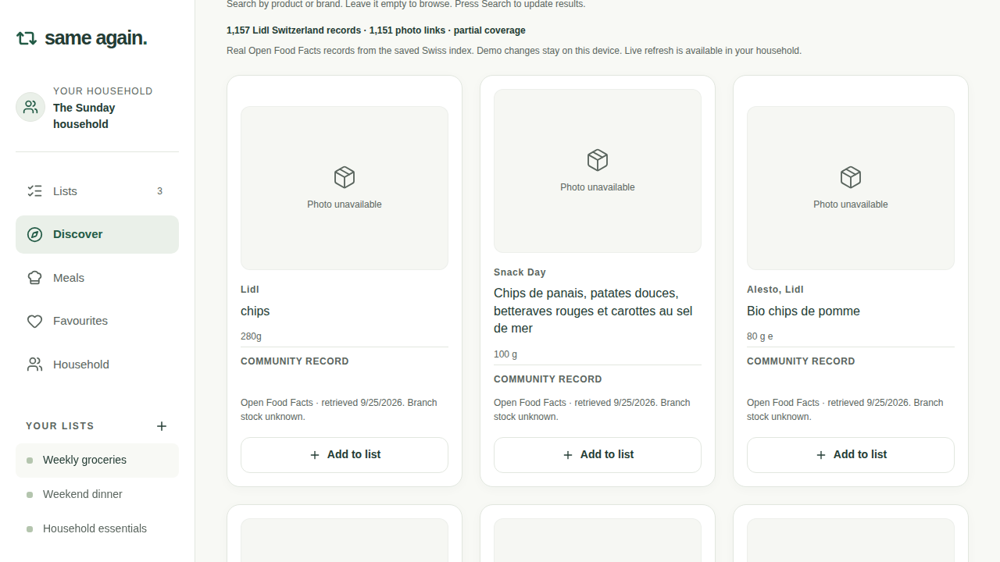 | 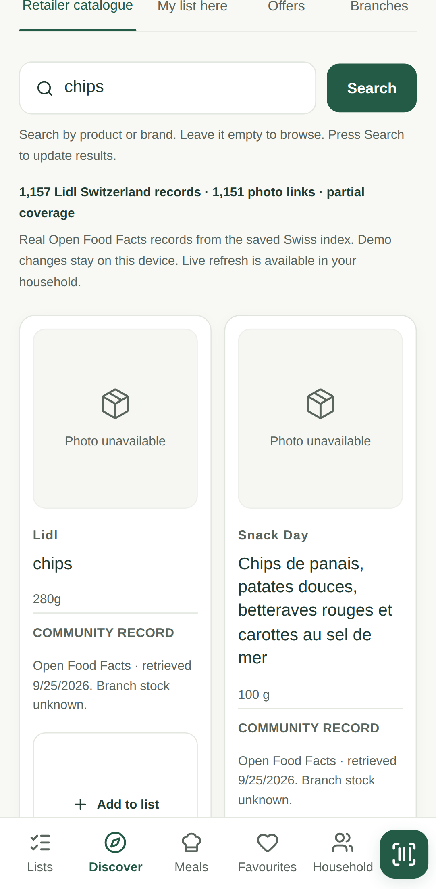 |
| Aldi search | 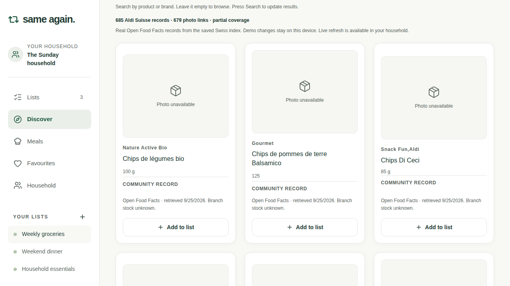 | 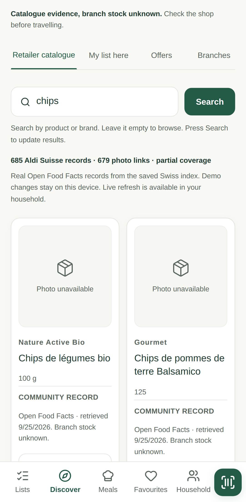 |
| Guide | 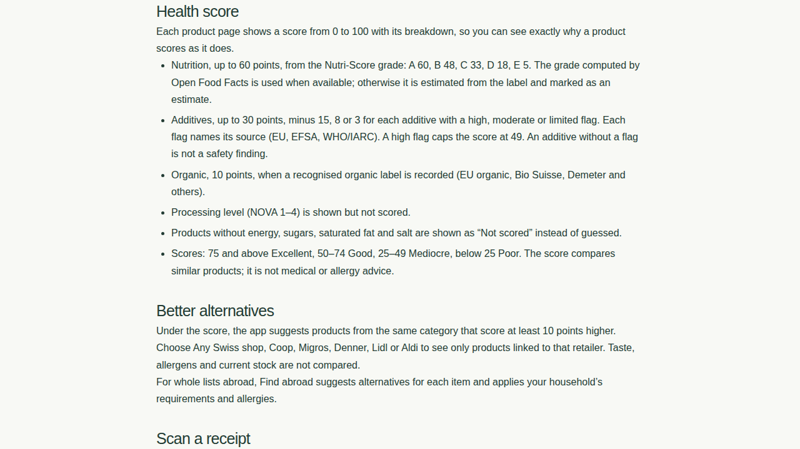 | 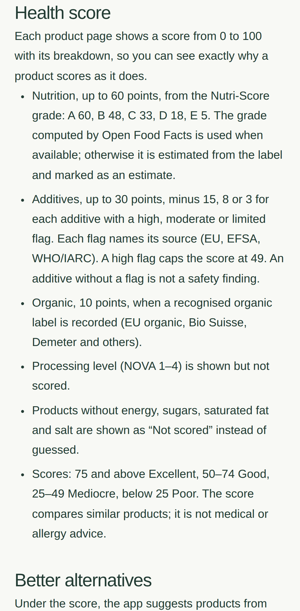 |

## 7. Open items

- The export snapshot must be refreshed by running `scripts/import-off-dump.py`; no scheduled refresh exists.
- OCR accuracy on real receipt photographs was not measured.
